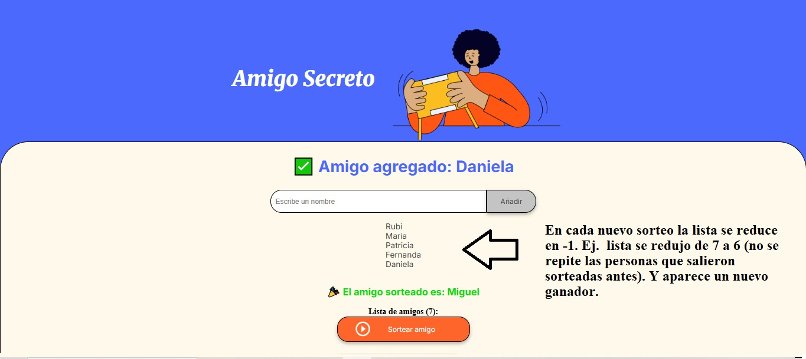
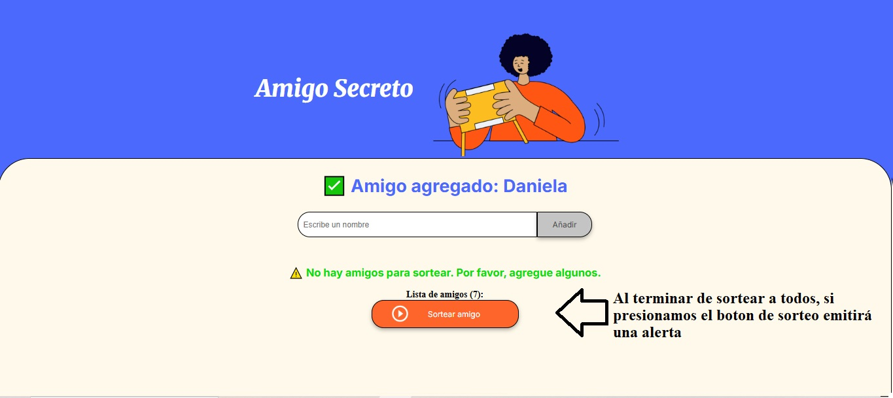

# AmigoSecretoChallence
El sistema permite sortear amigos de una lista previamente ingresada 
Instrucciones:
00 Inicio 

01 Añadir Amigos

02 Sortear Amigos

03 Sortear nuevamente amigos (filtra y solo muestra los pendientes)

04 Alerta de "No hay amigos para sortear"

05 Alerta de Nombre inválido

